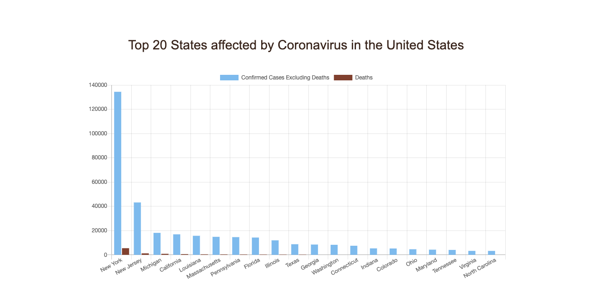

# COVID-19-dashboard
data visualization  of active, death and recovered cases for each country

## Description

Interactive Data Visualization with various js visualization libraries, Python, and MongoDB to display the covid-19 cases around the globe and in United States

 ### The Dataset includes:

 * Time Series Data From John Hopkins
   * confirmed cases, death, recovered globally
   * confirmed and deaths in United States
 
 * states and County data for united states from New York Times

  Source: https://github.com/CSSEGISandData/COVID-19, https://github.com/nytimes/covid-19-data
 
### Libraries:

 * D3, DC charts, google Charts (visualization)
 * Axios (library to call Promises in js), Lodash (helper functions)
 * pymongo to interacting with MongoDB (Notebook)
 * Flask to build the server, for routing
 * utility files in python to grab csv and convert to json before pushing it to database

 ### instructions to run the app:

 * cd Project_2_covid-19-pymongo-flask-app
 * run: app_pymongo_counties_states_US.ipynb and app_pymongo_time_series.ipynb which pushes teh data to cretaed database
 * python app.py -> to run server using flask connecting to the Frontend Visualization

## screen shots 
 
 
 
 
 

 ## link to view the static version of the site:
 https://arundhatic.github.io/COVID-19-dashboard/
